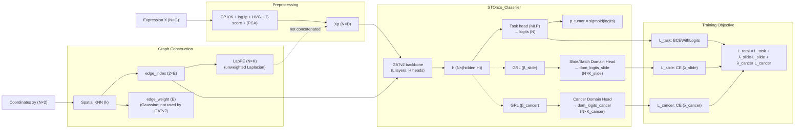

# STOnco Architecture Figure (Paper-Ready, Block-Level)

This note is a **paper figure drafting spec** based on the current code:

- Model: `stonco/core/models.py` (`STOnco_Classifier`, GATv2 backbone)
- Graph construction: `stonco/utils/preprocessing.py` (`Preprocessor`, `GraphBuilder`)
- Training loss & GRL schedule: `stonco/core/train.py`

Target configuration (as confirmed):

- Backbone: **GATv2**
- LapPE: **shown in the main figure**, **unweighted Laplacian**, **not concatenated** to node features
- Dual-domain adversarial learning: **enabled for both slide/batch domain and cancer domain**
- Figure detail level: **module-level** (no BN/LN/Dropout boxes in the figure)
- Figure text: **English**
- Deliverables: **textual structure + dimension spec + Mermaid + Graphviz DOT**

---

## 1. Symbols and Tensor Shapes

Per slide (one PyG graph per slide):

- `N`: number of spots (nodes) in the slide
- `G`: number of genes in the raw expression matrix
- `n_hvg`: number of HVGs selected (or `'all'`)
- `D`: feature dimension after preprocessing
  - If PCA is used: `D = pca_dim`
  - If PCA is not used: `D = n_hvg`
- `k`: KNN neighbors (graph connectivity), `k = knn_k`
- `E`: number of directed edges in `edge_index` (KNN is symmetrized, so typically `E ≈ 2 * N * k`)
- `K`: LapPE dimension, `K = lap_pe_dim`
- `H`: number of attention heads for GATv2, `H = heads`
- `hidden`: per-head hidden dimension in GATv2 (`out_channels` in `GATv2Conv`)
- `d_gnn`: backbone output dim per node
  - For GATv2 with `concat=True`: `d_gnn = hidden * H`

---

## 2. Pipeline Blocks (Exactly What the Code Does)

### 2.1 Input (NPZ)

- Expression: `X ∈ R^{N×G}`
- Coordinates: `xy ∈ R^{N×2}`
- (Training only) labels: `y ∈ {0,1}^{N}` (code supports `y = -1` as unlabeled mask)

### 2.2 Preprocessing (Gene Feature Engineering)

Module: `Preprocessor` (`stonco/utils/preprocessing.py`)

1. Library-size normalization (CP10K), spot-wise
2. `log1p`
3. HVG selection (`scanpy` seurat_v3 if available; else variance-top)
4. Percentile clipping (1%–99%)
5. Standardize (Z-score) + clip to `[-zclip, zclip]`
6. Optional PCA

Output:

- `Xp ∈ R^{N×D}`

### 2.3 Graph Construction (Spatial KNN Graph)

Module: `GraphBuilder` (`stonco/utils/preprocessing.py`)

1. KNN graph on spatial coordinates (`xy`)
2. Edge weights via Gaussian kernel:
   - `w_ij = exp(- ||xy_i - xy_j||^2 / (2σ^2))`
   - `σ = gaussian_sigma_factor * mean(nearest-neighbor distance)`
3. Symmetrize edges (add reverse direction)

Graph representation (PyG):

- `edge_index ∈ N^{2×E}`
- `edge_weight ∈ R^{E}`

Note (important for accurate figure caption):

- In the current implementation, **GATv2 backbone does not consume `edge_weight`** (it only uses `edge_index`).
- `edge_weight` is still computed/stored (and is used by other backbones or optional components).

### 2.4 Laplacian Positional Encoding (LapPE)

Module: `GraphBuilder.lap_pe(...)`

- Computes `PE ∈ R^{N×K}` from the (symmetrized) adjacency.
- In this confirmed setting:
  - **Unweighted Laplacian** (no Gaussian weights in Laplacian construction)
  - **Not concatenated** to node features (`concat_lap_pe = 0`)

Consistency note for the paper figure:

- In code, LapPE affects the model **only if** it is concatenated (`concat_lap_pe = 1`).
- Since this setting uses `concat_lap_pe = 0`, LapPE can be depicted as **computed/available but not injected** (use a dashed arrow or a greyed-out merge node in the figure).

Final node features actually fed to the backbone:

- `x = Xp ∈ R^{N×D}` (LapPE not concatenated)

---

## 3. Model Architecture (STOnco_Classifier)

Module: `STOnco_Classifier` (`stonco/core/models.py`)

### 3.1 GNN Backbone: GATv2 (L layers)

Backbone block:

`h = GATv2Backbone(x, edge_index)`

Layer spec (repeated `L = num_layers` times):

- `GATv2Conv(d_in → hidden, heads=H, concat=True)`
- (Implementation detail, not drawn at module-level): ReLU + LayerNorm + Dropout

Shapes:

- Input: `x ∈ R^{N×D}`
- Output: `h ∈ R^{N×(hidden·H)}`

### 3.2 Task Head: Tumor / Non-tumor Classifier

Module: `ClassifierHead`

Block-level MLP (spot-level):

- `h → z64 → logit`

Shapes:

- Input: `h ∈ R^{N×d_gnn}`
- Intermediate embedding: `z64 ∈ R^{N×64}`
- Output logits: `logits ∈ R^{N}` (binary, per spot)
- Output probabilities: `p_tumor = sigmoid(logits) ∈ (0,1)^{N}`

### 3.3 Dual-Domain Adversarial Heads (Enabled)

Modules:

- `DomainHead` for slide/batch domain
- `DomainHead` for cancer-type domain
- Gradient Reversal Layer (GRL) implemented by `grad_reverse(...)`

Both heads take the **same node embedding `h`** as input, and are **parallel branches**:

- Slide/batch domain branch:
  - `h --GRL(β_slide)--> dom_head_slide(h) → dom_logits_slide ∈ R^{N×K_slide}`
- Cancer-type domain branch:
  - `h --GRL(β_cancer)--> dom_head_cancer(h) → dom_logits_cancer ∈ R^{N×K_cancer}`

Where:

- `K_slide = n_domains_slide` (# of slide/batch domains)
- `K_cancer = n_domains_cancer` (# of cancer types/domains)

---

## 4. Training Objective (What to Show in the Figure)

Losses are computed in `stonco/core/train.py`:

1. Task loss (spot-level):
   - `L_task = BCEWithLogits(logits, y)` (only for labeled nodes where `y >= 0`)
2. Domain losses (spot-level, but targets are graph-level domains broadcast to all nodes in that graph):
   - `L_slide = CE(dom_logits_slide, slide_domain_label)`
   - `L_cancer = CE(dom_logits_cancer, cancer_domain_label)`
3. Total:

`L_total = L_task + λ_slide · L_slide + λ_cancer · L_cancer`

GRL strength scheduling:

- `β_*` is either DANN-style increasing (`grl_beta_mode='dann'`) or constant.

Figure suggestion:

- Use **dashed arrows** on the GRL branches, labeled `GRL (β_slide)` and `GRL (β_cancer)`.
- Place `λ_slide`, `λ_cancer` near the two domain losses.

---

## 5. Paper Figure Layout (Recommended)

### Option A (single figure with 3 panels)

**(a) Graph construction**

- `X, xy → Preprocessor → Xp`
- `xy → KNN graph → edge_index`
- `edge_index → LapPE (K dims) → PE` (dashed merge indicating "not concatenated")

**(b) Network**

- `x=Xp, edge_index → [GATv2 layer × L] → h → Task head → p_tumor`

**(c) Dual-domain adversarial learning**

- From `h` branch out to:
  - `GRL → Slide Domain Head → CE`
  - `GRL → Cancer Domain Head → CE`
  - Combine into `L_total`

---

## 6. Figure Labels (English, Ready to Paste)

Suggested block labels:

- **Preprocessing**: “CP10K + log1p + HVG + Z-score + (PCA)”
- **Graph**: “Spatial KNN graph (k=…)”
- **Edge weight**: “Gaussian edge weight” (optional note: “not used by GATv2”)
- **LapPE**: “Laplacian positional encoding (K=…)” (note: “computed, not concatenated”)
- **Backbone**: “GATv2 encoder (L layers, H heads)”
- **Task head**: “MLP classifier → tumor probability”
- **GRL**: “Gradient Reversal Layer”
- **Domain heads**: “Slide/Batch domain classifier”, “Cancer-type domain classifier”

---

## 7. Mermaid Draft (Flowchart)

You can paste this into a Mermaid renderer and export SVG.



---

## 8. Graphviz DOT Draft (Alternative)

```dot
digraph STOnco {
  rankdir=LR;
  labelloc="t";
  label="STOnco (GATv2 + LapPE shown (not concatenated) + Dual-Domain Adversarial)";

  node [shape=box, style="rounded", fontsize=10];

  subgraph cluster_pre {
    label="Preprocessing";
    X [label="Expression X (N×G)"];
    P [label="CP10K + log1p + HVG + Z-score + (PCA)"];
    XP [label="Xp (N×D)"];
    X -> P -> XP;
  }

  subgraph cluster_graph {
    label="Graph Construction";
    XY [label="Coordinates xy (N×2)"];
    KNN [label="Spatial KNN (k)"];
    EI [label="edge_index (2×E)"];
    EW [label="edge_weight (E)\\nGaussian; not used by GATv2"];
    LPE [label="LapPE (N×K)\\nunweighted Laplacian"];
    XY -> KNN -> EI;
    KNN -> EW;
    EI -> LPE;
  }

  %% LapPE is drawn but not injected
  LPE -> XP [style=dashed, label="not concatenated", fontsize=9];

  subgraph cluster_model {
    label="STOnco_Classifier";
    B [label="GATv2 backbone\\n(L layers, H heads)"];
    HN [label="h (N×(hidden·H))"];
    TH [label="Task head (MLP)\\nlogits (N)"];
    PT [label="p_tumor = sigmoid(logits)"];
    XP -> B;
    EI -> B;
    B -> HN -> TH -> PT;

    GRLS [label="GRL (β_slide)"];
    DHS [label="Slide/Batch Domain Head\\ndom_logits_slide (N×K_slide)"];
    GRLC [label="GRL (β_cancer)"];
    DHC [label="Cancer Domain Head\\ndom_logits_cancer (N×K_cancer)"];

    HN -> GRLS [style=dashed];
    GRLS -> DHS;
    HN -> GRLC [style=dashed];
    GRLC -> DHC;
  }

  subgraph cluster_loss {
    label="Training Objective";
    LT [label="L_task: BCEWithLogits"];
    LS [label="L_slide: CE (× λ_slide)"];
    LC [label="L_cancer: CE (× λ_cancer)"];
    LALL [label="L_total = L_task + λ_slide·L_slide + λ_cancer·L_cancer"];
    TH -> LT;
    DHS -> LS;
    DHC -> LC;
    LT -> LALL;
    LS -> LALL;
    LC -> LALL;
  }
}
```

