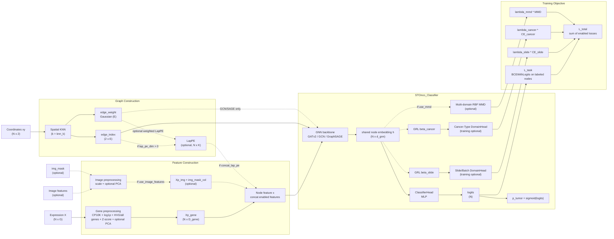
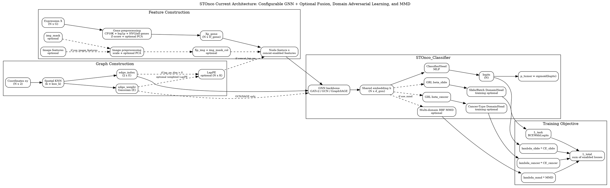

# STOnco Model Architecture Figure (Current Code, Block-Level)

This note is a paper figure drafting spec synchronized with the current code:

- Model: `stonco/core/models.py` (`STOnco_Classifier`, `GNNBackbone`)
- Feature construction and graph construction: `stonco/utils/preprocessing.py`
- Training data assembly and losses: `stonco/core/train.py`
- Inference path: `stonco/core/infer.py`, `stonco/core/batch_infer.py`

The current implementation is no longer a fixed "GATv2 only + LapPE shown but not concatenated" architecture. The model is a configurable GNN framework with optional image-feature fusion, optional LapPE concatenation, optional dual-domain adversarial heads, and optional MMD alignment on the shared GNN representation.

---

## 1. Current Defaults and Configurable Branches

Default training configuration in `stonco/core/train.py`:

| Component | Current default | Configurable behavior |
|---|---:|---|
| GNN backbone | `gatv2` | `gatv2`, `gcn`, or `sage` via `--model` |
| GNN hidden dims | `[256, 128, 64]` | scalar repeated by `num_layers`, or comma/list dims via `GNN_hidden` |
| GATv2 heads | `4` | used only when `model='gatv2'` |
| Gene PCA | off (`use_pca=False`) | if on, gene dim becomes `pca_dim` |
| HVG count | `n_hvg='all'` | integer top-HVG count or all genes |
| Image fusion | off | if on, choose `early_concat` or `dual_branch_residual_gate` |
| LapPE | off (`lap_pe_dim=0`) | if `lap_pe_dim>0`, compute PE; append only when `concat_lap_pe=True` |
| LapPE weights | unweighted | can use Gaussian edge weights via `lap_pe_use_gaussian=True` |
| Slide/batch domain head | off by default | enabled only if `use_domain_adv_slide=True` and a domain count is available |
| Cancer-type domain head | off by default | enabled only if `use_domain_adv_cancer=True` and a domain count is available |
| MMD alignment | off | if on, applies pairwise multi-domain RBF MMD on `h` |

Current code default for `image_fusion_mode` is `early_concat`.

Figure recommendation:

- Draw the main path as gene features -> graph -> GNN -> tumor probability.
- Draw image features, LapPE, domain heads, and MMD as optional/config-controlled branches.
- For a default-config figure, hide image fusion, hide LapPE, hide MMD, and hide both domain heads.

---

## 2. Symbols and Tensor Shapes

Per slide:

- `N`: number of spots/nodes
- `G`: number of genes in raw expression matrix
- `G_hvg`: selected gene count (`n_hvg`, or all genes)
- `D_gene`: output dimension of gene preprocessing
  - `D_gene = pca_dim` if `use_pca=True`
  - `D_gene = G_hvg` if `use_pca=False`
- `D_img_raw`: raw image feature dimension, typically 2048 when image features are present
- `D_img`: processed image feature dimension
  - `D_img = img_pca_dim` if `img_use_pca=True`
  - `D_img = D_img_raw` if `img_use_pca=False`
- `K`: LapPE dimension, `K = lap_pe_dim`
- `E`: number of directed PyG edges after KNN symmetrization, typically near `2*N*k`
- `H`: GATv2 attention heads, `H = heads`
- `L`: effective number of GNN layers, equal to `len(GNN_hidden)` after config normalization
- `g_i`: hidden dim configured for GNN layer `i`
- `d_gnn`: final GNN node embedding dimension
  - GATv2: `d_gnn = g_L * H` because `concat=True`
  - GCN or GraphSAGE: `d_gnn = g_L`
- `C_clf`: classifier latent dimension, equal to the last value in `clf_hidden`
- `K_slide`: number of slide/batch domains
- `K_cancer`: number of cancer-type domains

Final node input dimension:

```text
D_in = D_gene
     + I_image * (D_img + 1)
     + I_lap_concat * K
```

Where:

- `I_image = 1` only when `use_image_features=True`; the extra `+1` is the appended `img_mask` column.
- `I_lap_concat = 1` only when `lap_pe_dim>0`, PE is computed, and `concat_lap_pe=True`.

---

## 3. Data and Feature Construction

### 3.1 Inputs

Training NPZ path uses batched arrays such as:

- Gene expression: `Xs`, each slide `X in R^(N x G)`
- Coordinates: `xys`, each slide `xy in R^(N x 2)`
- Labels: `ys`, each slide `y in {0,1,-1}^N`
- Slide IDs: `slide_ids`
- Gene names: `gene_names`
- Optional image features when `use_image_features=True`: `X_imgs`, `img_masks`, `img_feature_names`

Single-slide inference NPZ uses keys such as `X`, `xy`, `gene_names`, and optional image keys. If a trained image-fusion model receives an inference slide without image keys, inference falls back to zero image features and `img_mask=0`.

Label convention:

- `y=1`: tumor
- `y=0`: non-tumor
- `y=-1`: unlabeled node; excluded from task BCE loss

### 3.2 Gene Preprocessing

Module: `Preprocessor` in `stonco/utils/preprocessing.py`

Current processing sequence:

1. Library-size normalization to CP10K.
2. Optional `log1p` transform (`do_log1p=True` by default).
3. HVG selection using Scanpy `seurat_v3` if available; otherwise top variance genes.
4. Percentile clipping at 1% and 99%.
5. StandardScaler Z-score normalization.
6. Clip normalized values to `[-zclip, zclip]`.
7. Optional PCA.

Output:

```text
Xp_gene in R^(N x D_gene)
```

Important current default:

- `n_hvg='all'`
- `use_pca=False`
- Therefore the default gene feature dimension is all selected genes, not `pca_dim=64`.

### 3.3 Optional Image Feature Preprocessing

Module: `ImagePreprocessor` in `stonco/utils/preprocessing.py`

Enabled only when `use_image_features=True`.

Processing sequence:

1. Use `img_mask` to select valid image-feature rows for fitting.
2. Fit StandardScaler on valid image features.
3. Optionally fit PCA (`img_use_pca=True`, default `img_pca_dim=256`).
4. Transform each slide; invalid image rows become zeros.
5. Append `img_mask` as a one-column feature.

Output before fusion:

```text
Xp_img in R^(N x D_img)
img_mask_col in R^(N x 1)
```

### 3.4 Spatial KNN Graph

Module: `GraphBuilder.build_knn(...)`

Steps:

1. Build KNN graph on spatial coordinates `xy`, using `knn_k`.
2. Compute Gaussian edge weights:

```text
w_ij = exp(- ||xy_i - xy_j||^2 / (2*sigma^2))
sigma = gaussian_sigma_factor * mean(nearest-neighbor distance)
```

3. Symmetrize by adding reverse edges.

PyG graph tensors:

```text
edge_index in N^(2 x E)
edge_weight in R^E
```

Backbone-specific use of `edge_weight`:

- GATv2 ignores `edge_weight`; it uses `edge_index`.
- GCN receives `edge_weight` when available.
- GraphSAGE uses the custom `WeightedSAGEConv`, which performs an edge-weighted neighbor mean.

### 3.5 Optional Laplacian Positional Encoding

Module: `GraphBuilder.lap_pe(...)`

Enabled only when `lap_pe_dim > 0`.

Current behavior:

- Computes normalized Laplacian eigenvector PE with shape `PE in R^(N x K)`.
- Uses an unweighted adjacency by default.
- Uses Gaussian edge weights only when `lap_pe_use_gaussian=True`.
- PE is appended to node features only when `concat_lap_pe=True`.

Feature assembly order in `build_node_features_early_fusion(...)`:

```text
x = [Xp_gene]
if image fusion: x = [Xp_gene, Xp_img, img_mask_col]
if LapPE concat: x = [previous_x, PE]
```

Output:

```text
x in R^(N x D_in)
```

---

## 4. Model Architecture: `STOnco_Classifier`

### 4.1 GNN Backbone

Module: `GNNBackbone`

Forward:

```text
h = GNNBackbone(x, edge_index, edge_weight)
```

Each GNN layer applies:

```text
graph convolution -> ReLU -> LayerNorm -> Dropout
```

Backbone choices:

| `model` | Layer implementation | Layer output dim | Edge weights |
|---|---|---:|---|
| `gatv2` | `GATv2Conv(dim_prev, g_i, heads=H, concat=True)` | `g_i * H` | ignored |
| `gcn` | `GCNConv(dim_prev, g_i)` | `g_i` | used when provided |
| `sage` | custom `WeightedSAGEConv(dim_prev, g_i)` | `g_i` | used for weighted mean |

Backbone output:

```text
h in R^(N x d_gnn)
```

### 4.2 Tumor / Non-Tumor Task Head

Module: `ClassifierHead`

Config:

- `clf_hidden`, default `[256, 128, 64]`
- Dropout inside the classifier is currently fixed to `0.1` when constructed by `STOnco_Classifier`

Forward:

```text
h -> Linear/BN/ReLU/Dropout blocks -> z_clf -> fc_out -> logits
```

Shapes:

```text
z_clf in R^(N x C_clf)
logits in R^N
p_tumor = sigmoid(logits)
```

Compatibility note:

- `forward(..., return_z=True)` returns `out['z_clf']`.
- It also returns `out['z64']` only when `C_clf == 64`.
- Therefore figure labels should use `z_clf` unless the plotted configuration fixes `clf_hidden[-1]=64`.

### 4.3 Optional Dual-Domain Adversarial Heads

Modules:

- `DomainHead` for slide/batch domain
- `DomainHead` for cancer-type domain
- `grad_reverse(...)` implemented by `GradientReversalFunction`

Each domain head is:

```text
Linear(d_gnn, dom_hidden) -> ReLU -> Linear(dom_hidden, n_domains)
```

Training branches:

```text
h -- GRL(beta_slide)  -> Slide/Batch DomainHead -> dom_logits_slide  in R^(N x K_slide)
h -- GRL(beta_cancer) -> Cancer-Type DomainHead -> dom_logits_cancer in R^(N x K_cancer)
```

The two heads are independent parallel classifiers attached to the same shared node embedding `h`.

Current code behavior:

- Both domain heads are disabled unless explicitly enabled in config and the corresponding domain count is known.
- The cancer-domain head is also used when `use_wb_align=True`, because the WB path needs cancer-domain labels.

Inference note:

- Inference constructs the model for the task path and loads weights with `strict=False`.
- Domain heads are not needed for prediction.
- When `image_fusion_mode='dual_branch_residual_gate'`, inference must provide `x_gene`, `x_img`, and `img_mask`.

### 4.4 Optional Return of Shared Embedding

`STOnco_Classifier.forward(..., return_h=True)` adds:

```text
out['h'] = h
```

This is used by MMD training and downstream embedding export/analysis paths.

---

## 5. Training Objective

Losses are computed in `stonco/core/train.py`.

### 5.1 Task Loss

Spot-level binary classification:

```text
L_task = BCEWithLogits(logits[y>=0], y[y>=0])
```

Unlabeled nodes (`y=-1`) are masked out.

### 5.2 Domain Adversarial Losses

Domain labels are graph-level fields:

- `bat_dom`: slide/batch domain index
- `cancer_dom`: cancer-type domain index

During mini-batch training, graph-level labels are expanded to nodes using `batch.batch`:

```text
slide_target_nodes  = batch.bat_dom[batch.batch]
cancer_target_nodes = batch.cancer_dom[batch.batch]
```

Optimization uses CrossEntropyLoss. When domain class weights are available, the optimized CE uses graph-frequency weights:

```text
w_domain = sqrt(n_graph / (n_domain * graph_count_domain))
```

Weights are clamped to `[0.5, 5.0]` and mean-normalized.

Weighted loss terms:

```text
L_slide  = lambda_slide  * CE_weighted(dom_logits_slide,  slide_target_nodes)
L_cancer = lambda_cancer * CE_weighted(dom_logits_cancer, cancer_target_nodes)
```

GRL beta schedule:

- `grl_beta_mode='dann'` (default): delayed DANN curve from 0 to the target beta.
- `grl_beta_mode='constant'`: beta equals the target value for all steps.
- `grl_beta_mode='linear'`: delayed linear warm-up to the target beta.

Defaults:

- `beta_slide_target = 1.0`
- `beta_cancer_target = 0.5`
- slide delay = 1 epoch
- cancer delay = 3 epochs

### 5.3 Optional MMD Alignment

Enabled only when `use_mmd=True`.

MMD operates on the shared GNN embedding `h`, not on `z_clf`.

Config:

- `mmd_on`: `slide`, `cancer`, or `both`
- `lambda_mmd`: default `0.05`
- multi-kernel RBF MMD with configurable `mmd_num_kernels`, `mmd_kernel_mul`, and optional fixed `mmd_sigma`
- optional `mmd_spots_per_slide` node sampling
- optional `mmd_max_pairs` cap on domain pairs per batch

Loss:

```text
L_mmd = lambda_mmd * MMD_slide   if mmd_on in {slide, both}
      + lambda_mmd * MMD_cancer  if mmd_on in {cancer, both}
```

### 5.4 Total Training Loss

Only enabled terms are present:

```text
L_total = L_task
        + L_slide
        + L_cancer
        + L_mmd
```

For the default training configuration, this reduces to:

```text
L_total = L_task
        + lambda_slide  * L_slide_CE
        + lambda_cancer * L_cancer_CE
```

because MMD is off by default.

---

## 6. Paper Figure Layout

### Recommended three-panel figure

**(a) Feature and graph construction**

- `X -> gene preprocessing -> Xp_gene`
- Optional `X_img, img_mask -> image preprocessing -> Xp_img, img_mask_col`
- `xy -> spatial KNN -> edge_index, edge_weight`
- Optional `edge_index (+ edge_weight) -> LapPE -> PE`
- Concatenate enabled node features into `x`

**(b) STOnco encoder and task head**

- `x` for `early_concat`, or `(x_gene, x_img, img_mask)` for `dual_branch_residual_gate`
- `x, edge_index, optional edge_weight -> configurable GNN backbone -> h`
- `h -> classifier MLP -> logits -> p_tumor`

**(c) Training-only adaptation losses**

- `h -> GRL(beta_slide) -> slide/batch domain head -> CE`
- `h -> GRL(beta_cancer) -> cancer-type domain head -> CE`
- Optional `h -> multi-domain RBF MMD`
- Optional `h -> generated-support WB` when `use_wb_align=True`
- Combine enabled losses into `L_total`

---

## 7. Figure Labels

Suggested English labels:

- **Gene preprocessing**: "CP10K + log1p + HVG/all genes + Z-score + optional PCA"
- **Image preprocessing**: "Image features + mask, optional PCA"
- **Feature fusion**: "Early fusion: concat enabled node features"
- **Graph**: "Spatial KNN graph"
- **Edge weight**: "Gaussian edge weight"
- **LapPE**: "Optional Laplacian positional encoding"
- **Backbone**: "Configurable GNN encoder: GATv2 / GCN / GraphSAGE"
- **Task head**: "MLP classifier -> tumor probability"
- **GRL**: "Gradient Reversal Layer"
- **Domain heads**: "Slide/Batch domain classifier", "Cancer-type domain classifier"
- **MMD**: "Optional multi-domain RBF MMD on h"
- **WB**: "Optional generated-support Wasserstein barycenter alignment on h"

Caption note:

- "GATv2 ignores Gaussian edge weights; GCN and weighted GraphSAGE consume them."

---

## 8. Mermaid Draft

Paste into a Mermaid renderer and export SVG.


```mermaid
flowchart LR
  %% ===== Inputs =====
  X["Expression X<br/>(N x G)"] --> GP
  XY["Coordinates xy<br/>(N x 2)"] --> KNN
  IMG["Image features<br/>(optional)"] -.-> IP
  IMGM["img_mask<br/>(optional)"] -.-> IP

  %% ===== Feature Construction =====
  subgraph S1["Feature Construction"]
    GP["Gene preprocessing<br/>CP10K + log1p + HVG/all genes + Z-score + optional PCA"]
    XG["Xp_gene<br/>(N x D_gene)"]
    IP["Image preprocessing<br/>scale + optional PCA"]
    XI["Xp_img + img_mask_col<br/>(optional)"]
    FEAT["Node feature x<br/>concat enabled features"]
    GP --> XG --> FEAT
    IP -. "if use_image_features" .-> XI -.-> FEAT
  end

  %% ===== Graph Construction =====
  subgraph S2["Graph Construction"]
    KNN["Spatial KNN<br/>(k = knn_k)"]
    EI["edge_index<br/>(2 x E)"]
    EW["edge_weight<br/>Gaussian (E)"]
    LPE["LapPE<br/>(optional, N x K)"]
    KNN --> EI
    KNN --> EW
    EI -. "if lap_pe_dim > 0" .-> LPE
    EW -. "optional weighted LapPE" .-> LPE
  end

  LPE -. "if concat_lap_pe" .-> FEAT

  %% ===== Model =====
  subgraph S3["STOnco_Classifier"]
    B["GNN backbone<br/>GATv2 / GCN / GraphSAGE"]
    H["shared node embedding h<br/>(N x d_gnn)"]
    CLF["ClassifierHead<br/>MLP"]
    LOG["logits<br/>(N)"]
    PROB["p_tumor = sigmoid(logits)"]

    FEAT --> B
    EI --> B
    EW -. "GCN/SAGE only" .-> B
    B --> H --> CLF --> LOG --> PROB

    GRLS["GRL beta_slide"]
    DHS["Slide/Batch DomainHead<br/>(training optional)"]
    GRLC["GRL beta_cancer"]
    DHC["Cancer-Type DomainHead<br/>(training optional)"]
    MMD["Multi-domain RBF MMD<br/>(optional)"]

    H -.-> GRLS --> DHS
    H -.-> GRLC --> DHC
    H -. "if use_mmd" .-> MMD
  end

  %% ===== Losses =====
  subgraph S4["Training Objective"]
    LT["L_task<br/>BCEWithLogits on labeled nodes"]
    LS["lambda_slide * CE_slide"]
    LC["lambda_cancer * CE_cancer"]
    LM["lambda_mmd * MMD"]
    LALL["L_total<br/>sum of enabled losses"]

    LOG --> LT
    DHS --> LS
    DHC --> LC
    MMD --> LM
    LT --> LALL
    LS --> LALL
    LC --> LALL
    LM --> LALL
  end
```

---

## 9. Graphviz DOT Draft


```dot
digraph STOnco {
  rankdir=LR;
  labelloc="t";
  label="STOnco Current Architecture: Configurable GNN + Optional Fusion, Domain Adversarial Learning, and MMD";

  node [shape=box, style="rounded", fontsize=10];
  edge [fontsize=9];

  subgraph cluster_features {
    label="Feature Construction";
    X [label="Expression X\n(N x G)"];
    GP [label="Gene preprocessing\nCP10K + log1p + HVG/all genes\nZ-score + optional PCA"];
    XG [label="Xp_gene\n(N x D_gene)"];
    IMG [label="Image features\noptional"];
    MASK [label="img_mask\noptional"];
    IP [label="Image preprocessing\nscale + optional PCA"];
    XI [label="Xp_img + img_mask_col\noptional"];
    FEAT [label="Node feature x\nconcat enabled features"];

    X -> GP -> XG -> FEAT;
    IMG -> IP [style=dashed, label="if use_image_features"];
    MASK -> IP [style=dashed];
    IP -> XI [style=dashed];
    XI -> FEAT [style=dashed];
  }

  subgraph cluster_graph {
    label="Graph Construction";
    XY [label="Coordinates xy\n(N x 2)"];
    KNN [label="Spatial KNN\n(k = knn_k)"];
    EI [label="edge_index\n(2 x E)"];
    EW [label="edge_weight\nGaussian (E)"];
    LPE [label="LapPE\noptional (N x K)"];

    XY -> KNN -> EI;
    KNN -> EW;
    EI -> LPE [style=dashed, label="if lap_pe_dim > 0"];
    EW -> LPE [style=dashed, label="optional weighted LapPE"];
  }

  LPE -> FEAT [style=dashed, label="if concat_lap_pe"];

  subgraph cluster_model {
    label="STOnco_Classifier";
    B [label="GNN backbone\nGATv2 / GCN / GraphSAGE"];
    H [label="Shared embedding h\n(N x d_gnn)"];
    CLF [label="ClassifierHead\nMLP"];
    LOG [label="logits\n(N)"];
    PROB [label="p_tumor = sigmoid(logits)"];

    FEAT -> B;
    EI -> B;
    EW -> B [style=dashed, label="GCN/SAGE only"];
    B -> H -> CLF -> LOG -> PROB;

    GRLS [label="GRL beta_slide"];
    DHS [label="Slide/Batch DomainHead\ntraining optional"];
    GRLC [label="GRL beta_cancer"];
    DHC [label="Cancer-Type DomainHead\ntraining optional"];
    MMD [label="Multi-domain RBF MMD\noptional"];

    H -> GRLS [style=dashed];
    GRLS -> DHS;
    H -> GRLC [style=dashed];
    GRLC -> DHC;
    H -> MMD [style=dashed, label="if use_mmd"];
  }

  subgraph cluster_loss {
    label="Training Objective";
    LT [label="L_task\nBCEWithLogits"];
    LS [label="lambda_slide * CE_slide"];
    LC [label="lambda_cancer * CE_cancer"];
    LM [label="lambda_mmd * MMD"];
    LALL [label="L_total\nsum of enabled losses"];

    LOG -> LT;
    DHS -> LS;
    DHC -> LC;
    MMD -> LM;
    LT -> LALL;
    LS -> LALL;
    LC -> LALL;
    LM -> LALL;
  }
}
```
