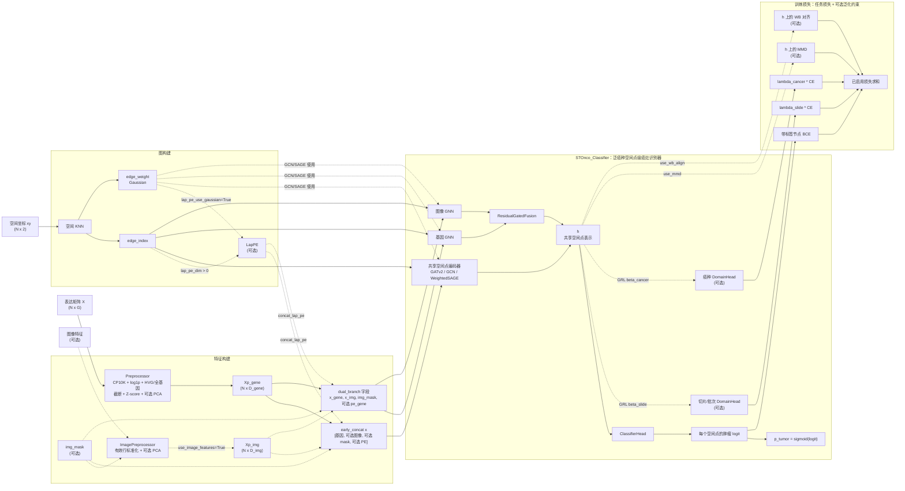
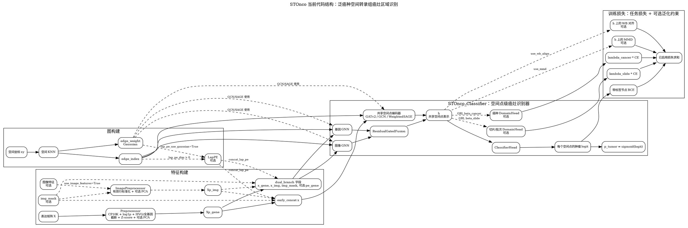

# STOnco 模型结构图（当前代码）

本文档只描述当前仓库中已经实现的 STOnco 结构和相关数据流，不扩展论文解释或未落到代码中的设计。

STOnco 当前代码中的核心任务是：在多癌种、多切片的 10x Visium 空间转录组数据上，学习一个可跨癌种复用的空间点级癌灶区域识别模型。模型的直接输出不是切片分类，也不是癌种分类，而是每个空间点属于肿瘤区域的概率 `p_tumor`。因此，主干结构围绕“基因表达特征 + 空间邻域图 -> 共享空间点表示 `h` -> 肿瘤/非肿瘤 logit”构建；域对抗、MMD 和 WB 对齐都是训练阶段围绕 `h` 加上的泛化约束，用于减少模型对特定切片、批次或癌种来源信号的依赖。

对应代码位置：

- 模型：`stonco/core/models.py`
- 模型构建工具：`stonco/core/model_utils.py`
- 特征预处理和图构建：`stonco/utils/preprocessing.py`
- 训练数据组装和损失：`stonco/core/train.py`
- 推理：`stonco/core/infer.py`、`stonco/core/batch_infer.py`
- WB 训练模块：`stonco/core/wb_potentials.py`

### 模块实际作用速览

| 模块 | 实际作用 |
|---|---|
| `Preprocessor` | 把不同切片、不同癌种来源的原始表达矩阵映射到统一基因特征空间，包括归一化、log、HVG/全基因选择、标准化和可选 PCA，是跨样本复用模型的输入基础。 |
| `ImagePreprocessor` | 对可用的空间点图像特征做标准化和可选 PCA；无效图像空间点输出零向量，并保留 `img_mask`，使模型可以在有/无图像信息的空间点上保持一致输入语义。 |
| `GraphBuilder` | 根据空间点坐标构建 KNN 图，同时生成 `edge_index` 和 Gaussian `edge_weight`；也负责可选 LapPE，使模型在局部空间邻域内识别连续癌灶区域。 |
| `build_node_feature_fields(...)` | 按 `image_fusion_mode` 把预处理后的基因、图像、mask、LapPE 组织成 PyG `Data` 需要的字段。 |
| `GNNBackbone` | 在空间图上传播和变换节点特征，输出每个空间点的共享表示 `h`；这是癌灶分类、域对抗、MMD 和 WB 对齐共同使用的中心表示。 |
| `WeightedSAGEConv` | GraphSAGE 的加权版本，用 `edge_weight` 做邻居加权均值。 |
| `ResidualGatedFusion` | 在双分支图像融合模式中，把图像分支表示投影到基因分支维度，并用 gate 控制图像残差加到基因表示上的幅度。 |
| `ClassifierHead` | 将共享节点表示 `h` 映射为每个空间点的肿瘤/非肿瘤 logit，是癌灶区域识别的任务输出头。 |
| `DomainHead` + `grad_reverse` | 训练时可选的域对抗分支，用切片/批次或癌种标签约束共享表示的域信息，目标是提升跨批次、跨癌种泛化能力；推理不依赖域头输出。 |
| MMD loss | 训练时可选的表示对齐项，在共享表示 `h` 上按切片/癌种域计算，作为域不变表示学习的额外正则。 |
| WB modules | 训练时可选的 WB 对齐模块，在 `STOnco_Classifier` 外部构建并作用于共享表示 `h`，用于把不同癌种的空间点表示分布推向共享支撑集/重心。 |
| `InferenceEngine` | 推理时复用保存的预处理器和模型配置，构图后加载模型并输出 `sigmoid(logits)`。 |

---

## 0. 面向泛癌种癌灶识别的结构主线

从研究目的看，当前 STOnco 结构可以分成四个功能层：

1. **跨样本输入标准化**：`Preprocessor` 把各切片的表达矩阵对齐到同一特征空间；可选的 `ImagePreprocessor` 对空间点图像特征做同样的训练集拟合、推理集复用处理。
2. **空间上下文建模**：`GraphBuilder` 以空间点坐标构建切片内 KNN 图，使 GNN 不只看单个空间点的表达，还聚合局部空间邻域信息，服务于空间上连续的癌灶区域识别。
3. **共享空间点表示学习**：`STOnco_Classifier.encode(...)` 通过单分支 GNN 或基因/图像双分支残差门控融合生成共享表示 `h`。后续所有任务输出和训练期对齐项都围绕 `h` 展开。
4. **任务输出与泛化约束**：`ClassifierHead` 对每个空间点输出肿瘤 logit；可选的切片/批次域头、癌种域头、MMD 和 WB 对齐在训练阶段约束 `h`，使它更偏向肿瘤区域相关模式，而不是某个特定癌种或批次的来源信息。

因此，画模型结构图时建议把 `h` 放在中心：主路径是“表达矩阵/可选图像特征 + 坐标 -> 图节点特征 -> GNN 编码器 -> `h` -> 肿瘤概率”；训练期辅助路径是“`h` -> 域对抗/MMD/WB 损失”。

---

## 1. 当前训练默认配置

`stonco/core/train.py` 中主训练入口的默认配置如下：

| 项目 | 默认值 | 代码行为 |
|---|---:|---|
| GNN 主干 | `gatv2` | 可配置为 `gatv2`、`gcn`、`sage` |
| GNN 隐藏维度 | `[256, 128, 64]` | 由 `normalize_gnn_config(...)` 规范化；标量会按 `num_layers` 重复 |
| GNN 层数 | `3` | 若 `GNN_hidden` 是列表，实际层数等于列表长度 |
| GATv2 注意力头数 | `4` | 只用于 `model='gatv2'` |
| Dropout | `0.3` | `gnn_dropout`、`clf_dropout`、`dom_dropout` 未显式设置时使用 `dropout` |
| 基因 PCA | `False` | `use_pca=False` 时直接使用标准化后的基因特征 |
| HVG | `all` | `n_hvg='all'` 时使用输入 NPZ 中所有基因 |
| 图像特征 | `False` | `use_image_features=True` 时才读取 `X_imgs`、`img_masks`、`img_feature_names` |
| 图像融合模式 | `early_concat` | 另一种已实现模式为 `dual_branch_residual_gate` |
| LapPE | `lap_pe_dim=0` | 大于 0 时计算 LapPE；只有 `concat_lap_pe=True` 才进入模型输入 |
| 域头 | 关闭 | `use_domain_adv_slide/cancer=True` 且域数量存在时才构建 |
| MMD | 关闭 | `use_mmd=True` 时在训练中使用 `h` 计算 |
| WB 对齐 | 关闭 | `use_wb_align=True` 时在训练中使用额外 WB 模块 |
| 分类头隐藏维度 | `[256, 128, 64]` | `ClassifierHead` 的多层 MLP 隐藏维度 |

默认训练损失只有带标签空间点上的二分类 BCE。域对抗、MMD、WB 都是显式开启后才加入。

---

## 2. 符号和张量

单张切片：

- `N`：空间点/node 数
- `G`：输入基因数
- `D_gene`：基因预处理输出维度
  - `use_pca=True` 时为 `pca_dim`
  - `use_pca=False` 时为实际 HVG/基因数量
- `D_img`：图像预处理输出维度
  - `img_use_pca=True` 时为图像 PCA 维度
  - `img_use_pca=False` 时为原始图像特征维度
- `K`：LapPE 维度，即 `lap_pe_dim`
- `E`：PyG 图边数；KNN 边会加入反向边
- `H`：GATv2 注意力头数
- `g_i`：第 `i` 个 GNN layer 的隐藏维度
- `d_gnn`：GNN 编码输出维度
  - GATv2：最后一层 `g_L * H`
  - GCN/SAGE：最后一层 `g_L`
- `C_clf`：分类头最后一层隐藏维度，即 `clf_hidden[-1]`

`early_concat` 模式的节点输入：

```text
x = [Xp_gene]
if use_image_features: x = [Xp_gene, Xp_img, img_mask_col]
if concat_lap_pe and PE exists: x = [previous_x, PE]
```

维度：

```text
D_in = D_gene
     + I_image * (D_img + 1)
     + I_lap * K
```

`dual_branch_residual_gate` 模式的图字段：

```text
x      = Xp_gene
x_gene = Xp_gene
x_img  = Xp_img
img_mask = img_mask
pe_gene = PE          # 仅在 concat_lap_pe=True 且 PE 存在时写入
```

该模式中 `pe_gene` 在 `STOnco_Classifier.encode(...)` 内部拼到 `x_gene` 上。

---

## 3. 数据、特征和图构建

### 3.1 输入数据

训练 NPZ 使用：

- `Xs`：每张切片的表达矩阵
- `xys`：每张切片的二维坐标
- `ys`：空间点标签
- `slide_ids`
- `gene_names`
- 可选图像字段：`X_imgs`、`img_masks`、`img_feature_names`

标签约定：

- `1`：肿瘤
- `0`：非肿瘤
- `-1`：无标签；训练 BCE 中被 mask 掉

### 3.2 基因预处理

`Preprocessor` 当前流程：

实际作用：将不同切片的原始表达矩阵转换到同一套基因特征空间，并保存训练时拟合出的 HVG 列表、scaler 和 PCA 信息，供推理复用。

1. 文库大小归一化到 `norm_target=1e4`
2. 可选 `log1p`
3. HVG 选择：Scanpy `seurat_v3` 可用时使用 Scanpy，否则按方差排序
4. 1%/99% 分位数截断
5. `StandardScaler`
6. clip 到 `[-zclip, zclip]`
7. 可选 PCA

输出：

```text
Xp_gene in R^(N x D_gene)
```

### 3.3 图像特征预处理

`ImagePreprocessor` 只在 `use_image_features=True` 时使用。

实际作用：只用 `img_mask==1` 的空间点拟合图像特征预处理器；transform 时保持空间点数量不变，使没有有效图像特征的位置为零，同时把图像是否可用的信息交给后续融合模块。

当前流程：

1. 用 `img_mask==1` 的行拟合 `StandardScaler`
2. 可选 PCA
3. transform 时无效图像行输出为 0

输出：

```text
Xp_img in R^(N x D_img)
img_mask in R^N
```

在 `early_concat` 中会额外把 `img_mask` 作为一列拼入 `x`；在 `dual_branch_residual_gate` 中 `img_mask` 作为单独字段进入模型。

### 3.4 空间 KNN 图

`GraphBuilder.build_knn(...)`：

实际作用：把每张切片的空间点坐标转换为空间邻接关系，让后续 GNN 在局部空间邻域内聚合信息；`edge_weight` 记录空间距离对应的 Gaussian 权重。

1. 在 `xy` 上构建 `knn_k + 1` 近邻，跳过自身
2. 计算 Gaussian `edge_weight`
3. 加入反向边

```text
w_ij = exp(- ||xy_i - xy_j||^2 / (2 * sigma^2))
sigma = gaussian_sigma_factor * mean(nearest-neighbor distance)
edge_index in N^(2 x E)
edge_weight in R^E
```

主干网络对 `edge_weight` 的使用：

- GATv2：不使用 `edge_weight`
- GCN：传入 `GCNConv`
- SAGE：传入自定义 `WeightedSAGEConv`

### 3.5 LapPE

`GraphBuilder.lap_pe(...)` 只在 `lap_pe_dim > 0` 时调用。

实际作用：从当前切片的图结构中计算节点位置编码；是否真正进入模型输入由 `concat_lap_pe` 控制。

当前行为：

- 计算归一化图拉普拉斯矩阵的小特征值对应特征向量
- 默认使用无权邻接矩阵
- `lap_pe_use_gaussian=True` 且提供 `edge_weight` 时使用 Gaussian 权重
- 只有 `concat_lap_pe=True` 时才写入模型输入字段

---

## 4. STOnco_Classifier

### 4.1 GNNBackbone

`GNNBackbone.forward(...)`：

实际作用：作为 STOnco 的图编码器，在 KNN 空间图上把每个空间点的输入特征编码为共享节点表示 `h`。后续分类头、域头、MMD 和 WB 都使用这个表示或由它派生的表示。

```text
h = x
对每一层:
    图卷积
    ReLU
    LayerNorm
    Dropout
```

当传入 `node_mask` 时，会在每层前后把被 mask 的节点特征置零；当前主要用于双分支图像 GNN。

| `model` | 层实现 | 输出维度 | 边权重 |
|---|---|---:|---|
| `gatv2` | `GATv2Conv(..., heads=H, concat=True)` | `g_i * H` | 不使用 |
| `gcn` | `GCNConv(...)` | `g_i` | 使用 |
| `sage` | `WeightedSAGEConv(...)` | `g_i` | 使用加权邻居均值 |

### 4.2 早期拼接模式

默认 `image_fusion_mode='early_concat'`：

实际作用：在进入 GNN 前完成特征级拼接。模型只看到一个统一的节点特征矩阵 `x`，不会在模型内部区分基因和图像分支。

```text
x -> GNNBackbone -> h
```

其中 `x` 已经在预处理阶段拼好可用的基因、图像 mask、图像特征和 LapPE。

### 4.3 双分支残差门控模式

`image_fusion_mode='dual_branch_residual_gate'` 时，模型包含：

实际作用：分别用基因 GNN 和图像 GNN 编码两类输入，再由 `ResidualGatedFusion` 根据 `img_mask` 和 gate 值决定每个空间点的图像残差信息是否以及多大程度加入基因表示。

- `gnn_gene = GNNBackbone(...)`
- `gnn_img = GNNBackbone(...)`
- `fusion = ResidualGatedFusion(...)`

编码流程：

```text
x_gene (+ pe_gene) -> gnn_gene -> h_gene
x_img * img_mask   -> gnn_img  -> h_img
h_gene, h_img, img_mask -> ResidualGatedFusion -> h
```

`ResidualGatedFusion` 当前结构：

```text
u_img = Linear(h_img) * img_mask
gate = sigmoid(MLP([LayerNorm(h_gene), LayerNorm(u_img), img_mask])) * img_mask
h = h_gene + gate * u_img
```

该模式要求 `use_image_features=True`，并且 forward 时提供 `x_gene`、`x_img`、`img_mask`。

### 4.4 ClassifierHead

分类头接在共享节点表示 `h` 后：

实际作用：把图编码器输出的每个空间点表示转换为二分类 logit；训练时用于 BCE loss，推理时经 sigmoid 变成肿瘤概率。

```text
h -> [Linear -> BatchNorm1d -> ReLU -> Dropout] * len(clf_hidden)
  -> z_clf
  -> Linear(..., 1)
  -> logits
```

输出：

```text
logits in R^N
p_tumor = sigmoid(logits)
```

`forward(..., return_z=True)` 返回 `z_clf`；当 `z_clf.shape[1] == 64` 时兼容性地额外返回 `z64`。`forward(..., return_h=True)` 返回共享表示 `h`。

### 4.5 可选域头

`STOnco_Classifier` 可以构建两个独立域分类头：

实际作用：仅在训练时启用，用 GRL 反向连接到共享表示 `h`，让主编码器在优化任务分类的同时接受域对抗梯度。推理预测不依赖这些域头输出。

- `dom_slide`
- `dom_cancer`

构建条件：

```text
use_domain_adv_slide=True  and n_domains_slide  is not None and > 0
use_domain_adv_cancer=True and n_domains_cancer is not None and > 0
```

`DomainHead` 结构：

```text
Linear(d_gnn, dom_hidden) -> ReLU -> Dropout -> Linear(dom_hidden, n_domains)
```

forward 中连接方式：

```text
h -> grad_reverse(beta_slide)  -> dom_slide  -> dom_logits_slide
h -> grad_reverse(beta_cancer) -> dom_cancer -> dom_logits_cancer
```

---

## 5. 训练损失

损失在 `stonco/core/train.py` 中计算，不属于 `STOnco_Classifier` 内部成员。

### 5.1 任务 BCE

```text
mask = y >= 0
L_task = BCEWithLogits(logits[mask], y[mask])
```

若一个 batch 中没有带标签节点，代码令 `L_task=0`。

### 5.2 域对抗 CE

若对应域头存在，图级域标签通过 `batch.batch` 展开到节点：

```text
slide_target_nodes  = batch.bat_dom[batch.batch]
cancer_target_nodes = batch.cancer_dom[batch.batch]
```

损失项：

```text
L_slide  = lambda_slide  * CrossEntropy(dom_logits_slide, slide_target_nodes)
L_cancer = lambda_cancer * CrossEntropy(dom_logits_cancer, cancer_target_nodes)
```

训练中可以使用由图数量统计得到的类别权重。GRL beta 支持 `dann`、`constant`、`linear` 三种模式。

### 5.3 MMD

`use_mmd=True` 时，模型 forward 使用 `return_h=True`，MMD 在共享表示 `h` 上计算。

实际作用：作为训练阶段的额外对齐损失，按配置在切片域、癌种域或两者之间约束 `h` 的分布差异。

配置项：

- `mmd_on`: `slide`、`cancer`、`both`
- `lambda_mmd`
- `mmd_num_kernels`
- `mmd_kernel_mul`
- `mmd_sigma`
- `mmd_max_pairs`
- `mmd_spots_per_slide`

### 5.4 WB 对齐

`use_wb_align=True` 时，训练代码额外构建：

实际作用：作为训练阶段的额外对齐模块，使用 `GeneratedSupportMap` 或 `PriorSupportGenerator` 生成支撑集，再由 `GeneratedSupportWBLoss` 在癌种域标签下计算 WB 相关损失。

- `GeneratedSupportMap` 或 `PriorSupportGenerator`
- `GeneratedSupportWBLoss`

WB 同样使用共享表示 `h`，并依赖 `cancer_dom` 展开后的节点级癌种标签。它不是 `STOnco_Classifier` 的子模块。

### 5.5 总损失

训练中总损失按已启用项累加：

```text
L_total = L_task
        + enabled(L_slide)
        + enabled(L_cancer)
        + enabled(L_mmd)
        + enabled(L_wb)
```

默认配置下：

```text
L_total = L_task
```

---

## 6. 推理路径

`InferenceEngine` 当前流程：

实际作用：把训练产物中的 `cfg`、预处理器和模型权重串起来，保证推理时的基因空间、图像特征处理、图构建方式和模型结构与训练保存的配置一致。

1. 从 `artifacts_dir/meta.json` 读取 `cfg`
2. 载入 `Preprocessor`
3. 若 `use_image_features=True`，载入 `ImagePreprocessor`
4. 对输入 NPZ 计算 `Xp_gene` 和可选 `Xp_img`
5. 构建 KNN 图、可选 LapPE、PyG fields
6. 用首个图的维度延迟构建 `STOnco_Classifier`
7. `load_model_strict(...)` 以 `strict=True` 加载 `model.pt`
8. 输出 `sigmoid(logits)`

推理使用和训练相同的模型构建工具 `build_stonco_model_from_cfg(...)`。

---

## 7. 图示标签

可用于图中的简短标签：

- 任务：`泛癌种空间转录组癌灶区域识别`
- 输出：`空间点级 p_tumor`
- 基因预处理：`CP10K + log1p + HVG/全基因 + Z-score + 可选 PCA`
- 图像预处理：`有效图像特征标准化 + 可选 PCA`
- 图结构：`空间 KNN 图`
- 边权重：`Gaussian edge_weight`
- LapPE：`可选 Laplacian PE`
- 编码器：`共享空间点编码器：GATv2 / GCN / Weighted GraphSAGE`
- 早期融合：`拼接已启用的节点特征`
- 双分支融合：`基因 GNN + 图像 GNN + 残差门控`
- 共享表示：`h：共享空间点表示`
- 分类头：`MLP 分类器 -> 肿瘤 logit`
- GRL：`梯度反转`
- 域头：`切片/批次域头`、`癌种域头`
- MMD：`h 上的训练期 MMD`
- WB：`h 上的训练期 WB 对齐`

---

## 8. Mermaid 草稿


```mermaid
flowchart LR
  X["表达矩阵 X<br/>(N x G)"] --> GP
  XY["空间坐标 xy<br/>(N x 2)"] --> KNN
  IMG["图像特征<br/>(可选)"] -.-> IP
  IMGM["img_mask<br/>(可选)"] -.-> IP

  subgraph F["特征构建"]
    GP["Preprocessor<br/>CP10K + log1p + HVG/全基因<br/>截断 + Z-score + 可选 PCA"]
    XG["Xp_gene<br/>(N x D_gene)"]
    IP["ImagePreprocessor<br/>有效行标准化 + 可选 PCA"]
    XI["Xp_img<br/>(N x D_img)"]
    FE["early_concat x<br/>[基因, 可选图像, 可选 mask, 可选 PE]"]
    DF["dual_branch 字段<br/>x_gene, x_img, img_mask, 可选 pe_gene"]
    GP --> XG
    XG --> FE
    XG --> DF
    IP -. "use_image_features=True" .-> XI
    XI -.-> FE
    XI -.-> DF
    IMGM -.-> FE
    IMGM -.-> DF
  end

  subgraph G["图构建"]
    KNN["空间 KNN"]
    EI["edge_index"]
    EW["edge_weight<br/>Gaussian"]
    PE["LapPE<br/>(可选)"]
    KNN --> EI
    KNN --> EW
    EI -. "lap_pe_dim > 0" .-> PE
    EW -. "lap_pe_use_gaussian=True" .-> PE
  end

  PE -. "concat_lap_pe" .-> FE
  PE -. "concat_lap_pe" .-> DF

  subgraph M["STOnco_Classifier：泛癌种空间点级癌灶识别器"]
    GNN["共享空间点编码器<br/>GATv2 / GCN / WeightedSAGE"]
    GG["基因 GNN"]
    IG["图像 GNN"]
    RG["ResidualGatedFusion"]
    H["h<br/>共享空间点表示"]
    CLF["ClassifierHead"]
    LOG["每个空间点的肿瘤 logit"]
    PROB["p_tumor = sigmoid(logit)"]
    DS["切片/批次 DomainHead<br/>(可选)"]
    DC["癌种 DomainHead<br/>(可选)"]

    FE --> GNN --> H
    DF --> GG --> RG
    DF --> IG --> RG
    RG --> H
    EI --> GNN
    EW -. "GCN/SAGE 使用" .-> GNN
    EI --> GG
    EI --> IG
    EW -. "GCN/SAGE 使用" .-> GG
    EW -. "GCN/SAGE 使用" .-> IG
    H --> CLF --> LOG --> PROB
    H -. "GRL beta_slide" .-> DS
    H -. "GRL beta_cancer" .-> DC
  end

  subgraph L["训练损失：任务损失 + 可选泛化约束"]
    LT["带标签节点 BCE"]
    LS["lambda_slide * CE"]
    LC["lambda_cancer * CE"]
    LM["h 上的 MMD<br/>(可选)"]
    LW["h 上的 WB 对齐<br/>(可选)"]
    SUM["已启用损失求和"]
    LOG --> LT --> SUM
    DS --> LS --> SUM
    DC --> LC --> SUM
    H -. "use_mmd" .-> LM --> SUM
    H -. "use_wb_align" .-> LW --> SUM
  end
```

---

## 9. Graphviz DOT 草稿


```dot
digraph STOnco {
  rankdir=LR;
  labelloc="t";
  label="STOnco 当前代码结构：泛癌种空间转录组癌灶区域识别";

  node [shape=box, style="rounded", fontsize=10];
  edge [fontsize=9];

  subgraph cluster_features {
    label="特征构建";
    X [label="表达矩阵 X"];
    GP [label="Preprocessor\nCP10K + log1p + HVG/全基因\n截断 + Z-score + 可选 PCA"];
    XG [label="Xp_gene"];
    IMG [label="图像特征\n可选"];
    MASK [label="img_mask\n可选"];
    IP [label="ImagePreprocessor\n有效行标准化 + 可选 PCA"];
    XI [label="Xp_img"];
    FE [label="early_concat x"];
    DF [label="dual_branch 字段\nx_gene, x_img, img_mask, 可选 pe_gene"];

    X -> GP -> XG;
    XG -> FE;
    XG -> DF;
    IMG -> IP [style=dashed, label="use_image_features=True"];
    MASK -> IP [style=dashed];
    IP -> XI [style=dashed];
    XI -> FE [style=dashed];
    XI -> DF [style=dashed];
    MASK -> FE [style=dashed];
    MASK -> DF [style=dashed];
  }

  subgraph cluster_graph {
    label="图构建";
    XY [label="空间坐标 xy"];
    KNN [label="空间 KNN"];
    EI [label="edge_index"];
    EW [label="edge_weight\nGaussian"];
    PE [label="LapPE\n可选"];

    XY -> KNN -> EI;
    KNN -> EW;
    EI -> PE [style=dashed, label="lap_pe_dim > 0"];
    EW -> PE [style=dashed, label="lap_pe_use_gaussian=True"];
  }

  PE -> FE [style=dashed, label="concat_lap_pe"];
  PE -> DF [style=dashed, label="concat_lap_pe"];

  subgraph cluster_model {
    label="STOnco_Classifier：空间点级癌灶识别器";
    GNN [label="共享空间点编码器\nGATv2 / GCN / WeightedSAGE"];
    GG [label="基因 GNN"];
    IG [label="图像 GNN"];
    RG [label="ResidualGatedFusion"];
    H [label="h\n共享空间点表示"];
    CLF [label="ClassifierHead"];
    LOG [label="每个空间点的肿瘤 logit"];
    PROB [label="p_tumor = sigmoid(logit)"];
    DS [label="切片/批次 DomainHead\n可选"];
    DC [label="癌种 DomainHead\n可选"];

    FE -> GNN -> H;
    DF -> GG -> RG;
    DF -> IG -> RG -> H;
    EI -> GNN;
    EW -> GNN [style=dashed, label="GCN/SAGE 使用"];
    EI -> GG;
    EI -> IG;
    EW -> GG [style=dashed, label="GCN/SAGE 使用"];
    EW -> IG [style=dashed, label="GCN/SAGE 使用"];
    H -> CLF -> LOG -> PROB;
    H -> DS [style=dashed, label="GRL beta_slide"];
    H -> DC [style=dashed, label="GRL beta_cancer"];
  }

  subgraph cluster_losses {
    label="训练损失：任务损失 + 可选泛化约束";
    LT [label="带标签节点 BCE"];
    LS [label="lambda_slide * CE"];
    LC [label="lambda_cancer * CE"];
    LM [label="h 上的 MMD\n可选"];
    LW [label="h 上的 WB 对齐\n可选"];
    SUM [label="已启用损失求和"];

    LOG -> LT -> SUM;
    DS -> LS -> SUM;
    DC -> LC -> SUM;
    H -> LM [style=dashed, label="use_mmd"];
    H -> LW [style=dashed, label="use_wb_align"];
    LM -> SUM;
    LW -> SUM;
  }
}
```
